# SendKit — Sơ đồ flow hệ thống

Tài liệu này giải thích hệ thống theo cách đơn giản, đồng thời phân biệt rõ:

- **Current**: đã có trong source hiện tại.
- **Planned**: kiến trúc mục tiêu, chưa có trong source hiện tại.

## 1. Bức tranh tổng quan

Hãy hình dung SendKit là một trạm điều phối:

- **Local** là bàn làm việc chính: nơi viết code và giữ workspace đầy đủ.
- **VPS** là trợ lý chạy nền: nhận task, deploy và test bằng Playwright.
- **Database** là sổ điều phối chung: lưu task, quyết định, tiến độ và event.
- **Telegram** là remote control: giao việc, nhận báo cáo và trả lời khi agent bị stuck.
- **GitHub** là nơi đồng bộ code bằng commit/branch.

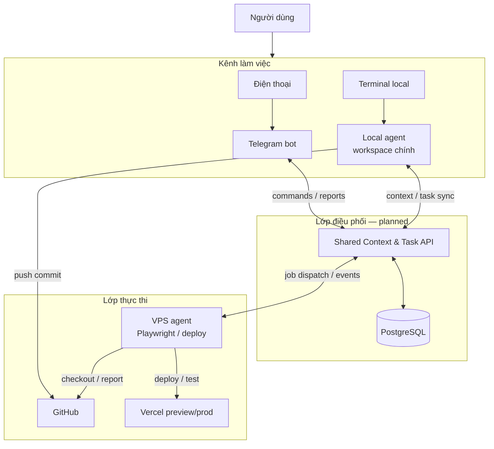

> Trong source hiện tại chưa có `Shared Context & Task API`, PostgreSQL, queue, VPS agent orchestration hoặc Telegram inbound flow. Đây là các thành phần cần bổ sung.

## 2. Những gì source hiện tại đang có

Cả Local MCP và Remote MCP đều expose cùng một tool `telegram`, rồi gọi chung operation trong `packages/core`.

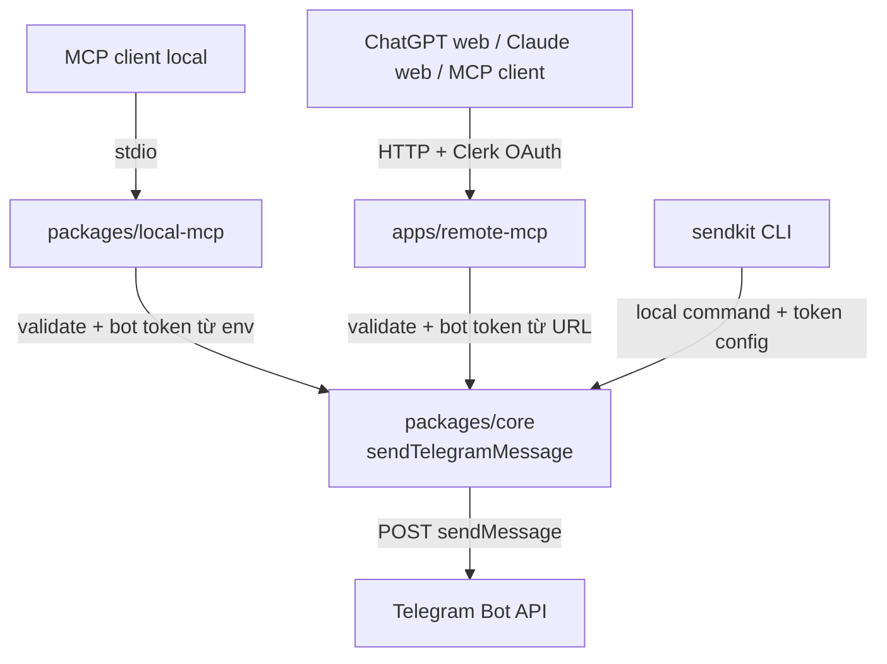

### Current: Local MCP

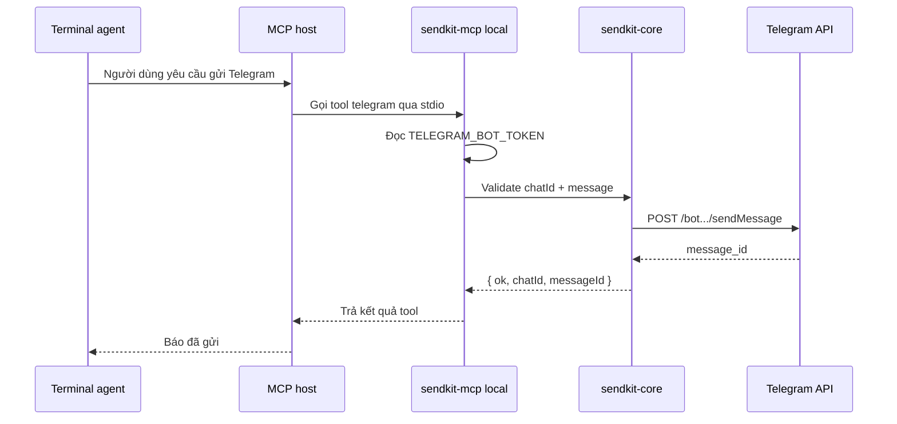

Local MCP là một process chạy trên cùng máy với MCP host. Nó chưa lưu session, project context hoặc task history.

### Current: Remote MCP

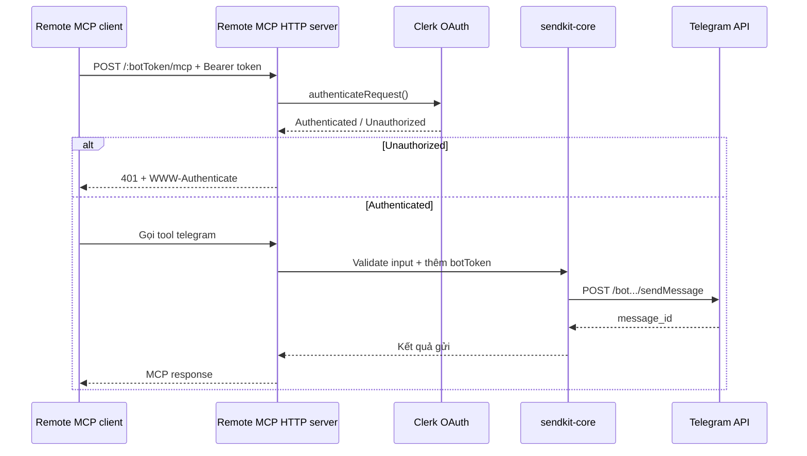

Remote MCP hiện là HTTP gateway có Clerk authentication. Nó chưa phải cloud agent runner và cũng chưa có memory/session persistence.

## 3. Kiến trúc context và task mục tiêu

Nên tách hai loại dữ liệu:

```text
Session context
- Nội dung trao đổi cần nhớ
- Mục tiêu
- Quyết định và lý do
- Context summary

Task state
- Task đang ở trạng thái nào
- Agent nào đang xử lý
- Commit nào là input
- Test/deploy result
- Dependency hoặc blocker
```

Tách model không có nghĩa là local không nhìn thấy task. Khi local sync, backend sẽ ghép các task update liên quan vào context hiện tại.

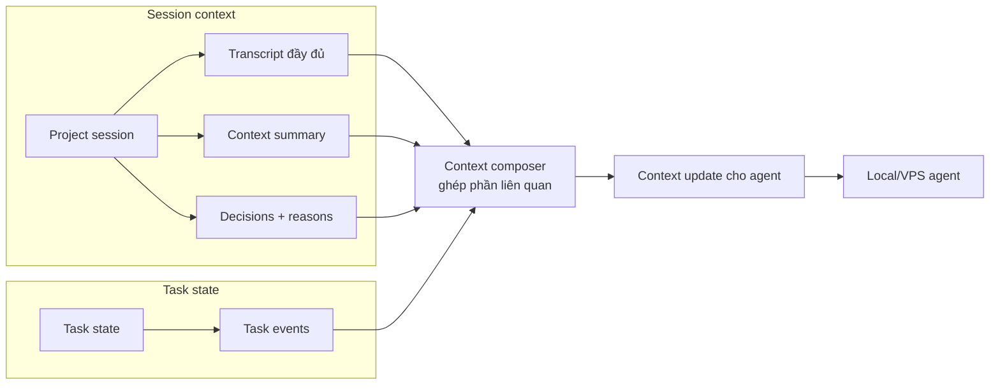

Database trung tâm là nguồn sự thật cho việc điều phối. Local vẫn là nơi giữ source code và full workspace chính.

## 4. Local mở máy lại và sync kết quả cũ

Local không cần giữ kết nối liên tục để không mất kết quả. Agent lưu một cursor, ví dụ `lastEventId`, rồi lấy các event mới khi khởi động hoặc ở checkpoint.

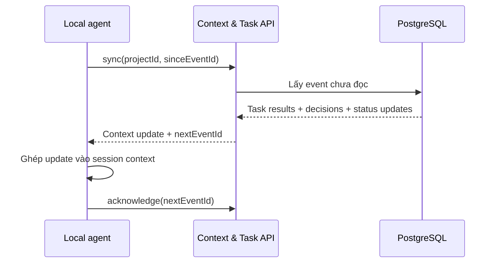

Ví dụ local có thể nhận được:

```text
Task A — VPS test commit abc123
- 23 test passed
- 1 test failed
- Có screenshot và log
- Đề xuất kiểm tra checkout flow
```

## 5. Local làm task B trong khi VPS test task A

Task A và task B phải có định danh riêng. VPS test đúng commit đã được giao, không test một working tree local đang thay đổi.

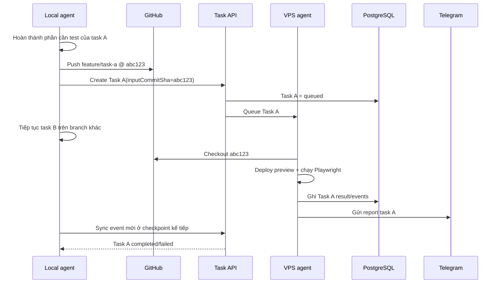

Kết quả task A không nên nằm trong queue cho đến khi task B hoàn tất. Kết quả phải được ghi vào database ngay. Nếu task B không phụ thuộc A, local tiếp tục B bình thường.

Nếu B phụ thuộc A:

```text
Task B.dependsOn = Task A
Task B.status = blocked

Task A completed
→ backend phát event
→ B được mở khóa
→ agent tiếp tục B
```

## 6. VPS giao task từ Telegram

Telegram không chỉ gửi notification; trong kiến trúc mục tiêu nó là giao diện điều khiển hai chiều.

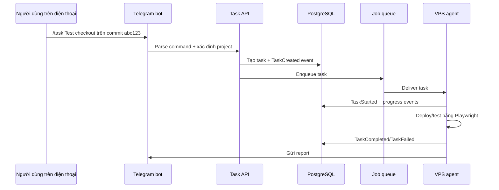

Source hiện tại chưa có Telegram webhook/long polling, command parser, queue hoặc VPS worker. `telegram` hiện chỉ là chiều agent → Telegram.

## 7. Local bị stuck và cần user quyết định

Khi local agent chạy vào rule yêu cầu review, nó không nên chỉ đứng im. Nó phải ghi một `DecisionRequested` event và gửi notification.

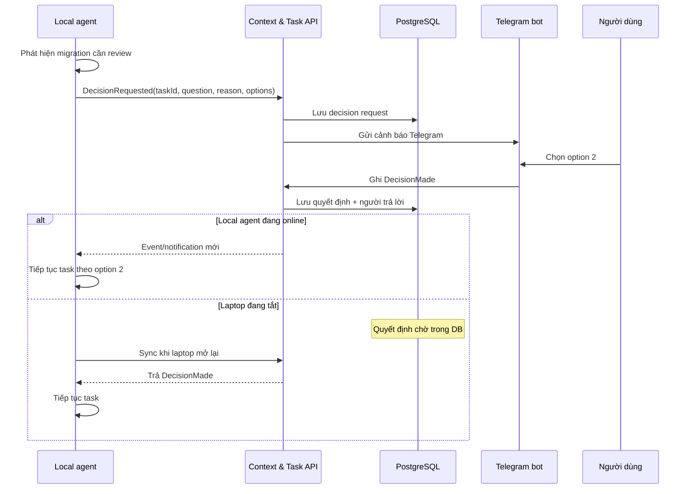

Nếu local không gửi heartbeat:

```text
agent offline ≠ agent stuck
```

Backend chỉ có thể kết luận local offline khi heartbeat hết hạn. Muốn xác định stuck, local agent phải chủ động gửi `Blocked` hoặc `DecisionRequested`.

## 8. Cách các agent nhận update

Ở phiên bản đầu, polling là đủ và dễ vận hành:

```text
Local agent → get_task_updates(projectId, sinceCursor)
```

Sau này có thể dùng WebSocket hoặc SSE để nhận gần như real-time.

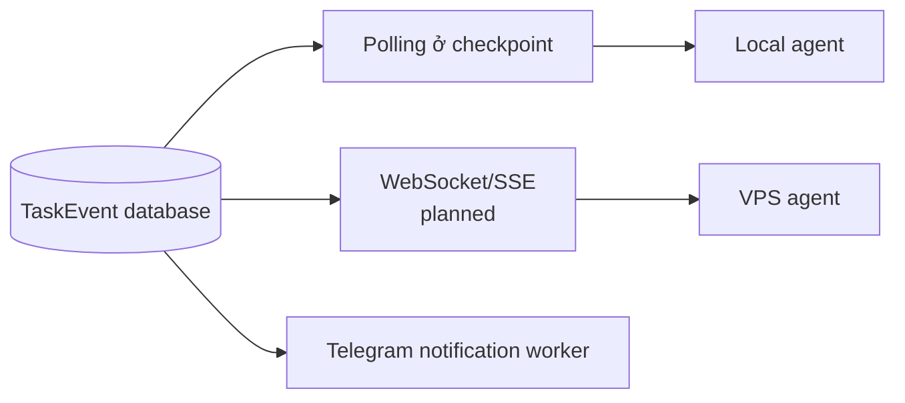

Queue nên dùng để phân phối job và notification. Database mới là nơi lưu kết quả lâu dài để agent offline vẫn sync lại được.

## 9. Context nào được gửi vào session?

Mỗi lần agent mở hoặc sync session, backend nên trả context theo lớp:

```text
1. Project summary
2. Session summary
3. Decisions còn hiệu lực
4. Task hiện tại của agent
5. Task update liên quan
6. Các event mới kể từ cursor trước
7. Transcript/memory chi tiết khi agent search thêm
```

Không nên nhét mọi task và toàn bộ transcript vào mọi request. Context nên được compose theo nhu cầu.

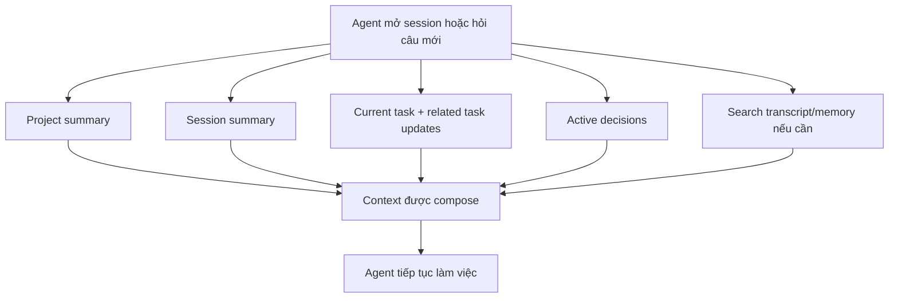

## 10. Phân chia nơi lưu dữ liệu

```text
PostgreSQL/Supabase
- projects, sessions, tasks
- transcript metadata và message
- decisions, task events, heartbeat
- context summaries

Object storage / GitHub / Vercel artifacts
- Playwright screenshots
- video, trace, log lớn
- build artifacts

GitHub
- source code
- branch, commit, pull request
- diff làm input chính xác cho test

Local machine
- working tree
- full workspace
- cache/full transcript lớn nếu cần
- local embeddings nếu muốn chạy offline
```

Supabase hoặc PostgreSQL trên VPS đều có thể làm database trung tâm. Source hiện tại chưa triển khai lựa chọn nào.

## 11. Tóm tắt flow mục tiêu

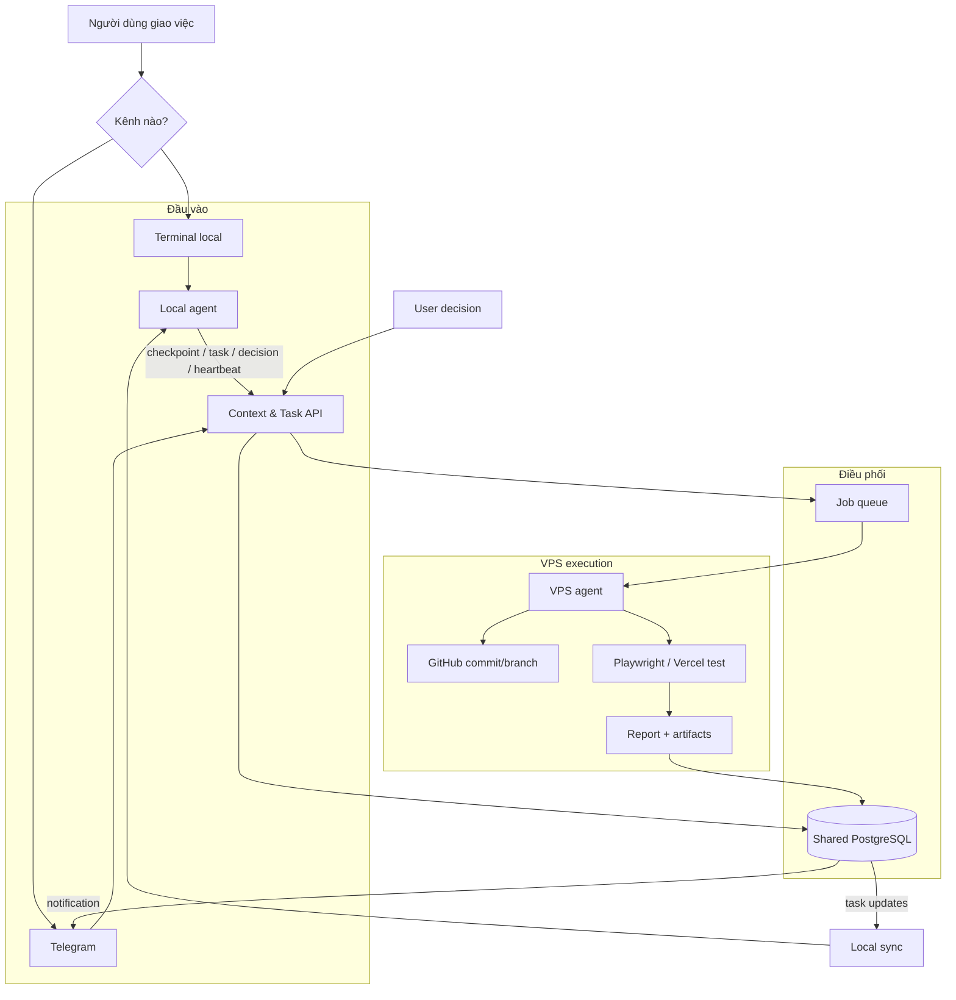

## 12. Nguyên tắc thiết kế

1. `projectId` và `taskId` là định danh điều phối; không dựa vào tên chat để phân biệt project.
2. `sessionId` của business không phụ thuộc vào vòng đời kết nối MCP.
3. Mọi task test phải tham chiếu commit SHA cụ thể.
4. Database lưu event ngay khi xảy ra; không chờ agent khác rảnh.
5. Queue dùng để giao việc/thông báo, không phải nơi duy nhất giữ kết quả.
6. Local offline thì event vẫn phải tồn tại để sync khi mở lại.
7. `blocked`, `offline`, `failed` và `waiting_review` là các trạng thái khác nhau.
8. Quyết định cần lưu cả nội dung và lý do để agent sau này hiểu vì sao.
9. Telegram là control/notification channel, không phải nguồn context duy nhất.
10. Vector search chỉ là lớp tìm kiếm bổ sung; dữ liệu structured và transcript gốc vẫn cần được lưu.
